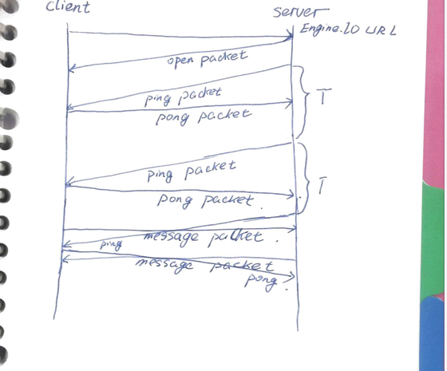

# engine.io-protocol-cn

## 1 译者序

这是中文版的engine io协议。原协议见：https://github.com/Automattic/engine.io-protocol。

## 2 前言

这个文档描述了Engine.IO 协议。该协议的实现，见 engine.io-parser,engine.io-client和 engine.io。

## 3 修订

这是Engine.IO的第三个修订版本。

## 4 Engine.IO会话（session）的分析

1 传输建立了一个指向Engine.IO URL的连接。

2 服务器端返回了一个使用json格式的，意图为打开传输连接数据包（原文为open packet:
    
    1 sid ：会话 id(String类型)
    
    2 upgrades ：可能的传输升级。（字符串类型的数组）
    
    3 pingTimeout : 服务器端配置 ping 超时，用于客户端探查
    服务器端有无响应。（Number类型）

3 当客户端收到服务器按照一定的周期发送的 ping 包时，需要发送 pong包作为响应。

4 客户端和服务器可以任意交换 message 包。

5 轮询传输会发送一个 close包，因为它会不停的打开，关闭。（Polling transports can send a close packet to close the socket, since they're expected to be "opening" and "closing" all the time.）

# URLs

  一个 Engine.IO的url由以下部分组成：
  
  
 /engine.io/[?]
 
 
 - engine.io的路径原则上只能被在它之上的高层次的框架（该框架的协议承载层为engine.io 协议）改变。
 
 
 - [?] 询问部分是可选择的，有四种可供选择的关键字：
 
 
     - `transport`: 暗示了传输类型的名称。支持的属性值有：polling,flashsocket,websocket。
     
     - `j`:如果传输类型是`polling`，并且需要JSONP响应，j必须设置为JSONP响应的索引。(j: if the transport is polling but a JSONP response is required, j must be set with the JSONP response index.)
     
     -`sid`:如果服务器曾经给予客户端一个会话id,那么这个id一定会包含在询问部分（[?]）
     
     -`b64`:如果客户端不能支持XHR2，`b64=1`将会被通过[?]部分发送给服务器，用于告知服务所有二进制数据要是用base64编码。
    ( xhr2的内容见 http://www.ruanyifeng.com/blog/2012/09/xmlhttprequest_level_2.html)
    
FAQ: `engine.io`部分是可更改的么？

可以的。服务器端可以在不同的路径片段下去拦截请求。

FAQ: 什么决定了URL中要包含的属性？

一般地，url中仅仅是表明该请求是否由Engine.IO实例来处理，所以仅仅需要engine.io(前缀)和资源。（
It's convention that the path segments remain only that which allows to disambiguate whether a request should be handled by a given Engine.IO server instance or not. As it stands, it's only the Engine.IO prefix (/engine.io) and the resource (default by default).）

# Encoding

这里有两种不同的编码格式：

1 packet
2 payload

## Packet

一个编码过的包（packet）可以是UTF-8字符串或者是二进制数据。这个（packet）作用于字符串的数据包编码格式要遵循：

`<packet type id > [<data>] `

例如：

`2probe`

二进制的数据编码也是相同的。当发送二进制数据时，数据包类型id（packet type id）将会在数据中的第一个字节中出现。之后就是真正要传送的数据。

`4|0|1|2|3|4|5`

在上述的例子中每一个字节都会用一个pipe符号来分割并用一个整数来表示。上述的例子是一个消息（message）类型的数据包，并且包含对应于整数值为0，1，2，3，4，5的二进制数据。

数据包类型id(packet type id)是一个整数。以下是可以接受的数据包类型。

#### 0 open

当一个新的传输连接打开时，服务器端会发送该类型数据包（用于确认）

#### 1 close

请求关闭这条传输连接，但是并不会自动关闭连接。

#### 2 ping

用于客户端发送。 服务器端需使用包含同样数据的pong数据包作为应答。

1 客户端发送： 2probe

2 服务器端发送：3 probe

#### 3 pong

用于服务器端发送，应答客户端发送的ping数据包。

#### 4 message

实际发送的消息，客户端和服务器端都可以通过其回调函数得到数据。

**例1**

1 服务器端发送： 4HelloWorld

2 客户端收到并调用其回调函数`socket.on('message,function(data){console.log(data);});`

**例2**

1 客户端发送：4HelloWorld

2 服务器端接收到并调用其回调函数`socket.on('message',function(data){console.log(data);});`

#### 5 upgrade

在engine.io切换另一个传输连接之前，需要进行测试是否服务器端和客户端可以在这个传输连接上进行通信。如果测试成功，客户端会发送一个upgrade数据包用于请求刷新它在旧连接上的缓存并且切换到新的传输连接上去。

#### 6 noop

一种空操作数据包（noop packet）.主要用于当一个新的websocket连接被接收时，强制一个轮询的周期。

**例**

1 客户端通过新的传输进行连接。

2 客户端发送`2probe`.

3 服务器端需要接收并响应`3probe`.

4 客户端接收并发送 5.

5 服务器端刷新并关闭旧的连接并切换到新的连接。

## Payload

Payload是指一系列绑定到了一起的编码后的数据包。当只有字符串被发送并且XHR2不被支持时使用，payload编码格式如下：

`<length1>:<packet1>[<length2>:<packet2>[...]]`

length: 数据包的字符长度。

packet: 实际的数据包见上一节（packet）

当XHR2不被支持时，发送二进制数据时我们使用了相同编码原则。将数据使用base64编码成字符串进行发送。为了解码，一个标识符`b`放置在数据包的前面。任意数量的字符串和base64编码的字符串的集合可以用于发送。下面是一个关于base64编码的消息：

`<length of base64 representation of the data +1>:b<packet1 type><packet1 data in b64>[...]`

当XHR2被支持时，我们会使用一种简单的原则，任何数据都会直接编码为二进制数据。所以这些数据可以以二进制的形式在XHR上传送。格式如下：

`<0 for string data, 1 for binary data><Any number of numbers between 0 and 9><The number 255><packet1 (first type,
then data)>[...]`

(If a combination of UTF-8 strings and binary data is sent, the string values are represented so that each character is written as a character code into a byte.

The payload is used for transports which do not support framing, as the polling protocol for example.)

## 传输

一个engine.io服务器必须支持三种传输方式：

1 websocket

2 flashsocket

3 polling : jsonp、xhr

### Polling

轮询传输包含了两个部分：一个是客户端使用get请求从服务器端获取数据。一个是客户端通过使用payload格式的数据包，使用post请求向服务器端发送数据。

### XHR

服务器端必须支持跨域共享的响应。

### JSONP

### websocket

## Transport upgrading

一个连接通常在开始的时候使用轮询的方式（XHR或者JSONP）。客户端侧通常发送一个probe用于测试websocket的支持情况，如果服务器端返回probe,一个升级包（upgrade packet）就会被发送至客户端。

为了确保没有消息丢失，升级包会在已经存在的传输中的缓存被刷新之后进行发送。已经存在的传输终止。

当服务器端收到升级数据包（upgrade packet）,这就意味着这是一个新的传输通道，所有的缓存将会被发送。

## Timeouts(超时)

客户端必须要使用`pingTimeout`作为握手的一部分（在`open`数据包中），这样就能够判定服务器端是否未响应。

如果没有上述类型的数据包在超时时间内被接收，客户端会认为socket已经断开。

    
   
     

